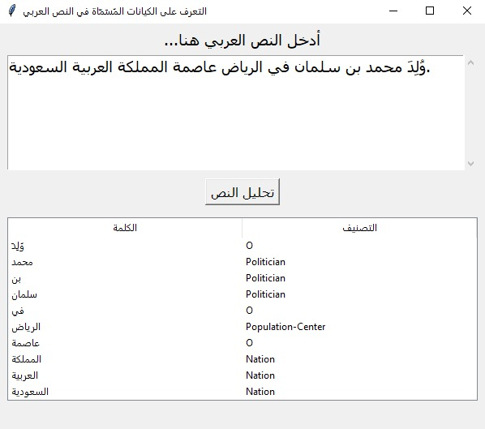

# Arabic Named Entity Recognition (ANER)

This project fine-tunes a pre-trained BERT model (`asafaya/bert-base-arabic`) for Named Entity Recognition (NER) on Arabic text using the WikiFANE_Gold_2014_500K dataset. It includes preprocessing, model training, evaluation, and a GUI demo using Gradio and Tkinter.

---

## 📌 Project Overview

- **Goal:** Automatically identify and classify named entities (e.g., people, places, organizations) in Arabic text.
- **Challenges Addressed:**
  - Arabic diacritics and script normalization
  - Morphological complexity
  - Entity boundary ambiguity

---

## 📂 Dataset & Preprocessing

- **Dataset Used:** [WikiFANE_Gold_2014_500K](https://fsalotaibi.kau.edu.sa/Pages-Arabic-NE-Corpora.aspx)
- **Stats:**
  - ~500K tokens, 15,763 sentences
  - 102 unique entity tags (e.g., Nation, Politician, Population-Center)
- **Preprocessing Steps:**
  - Normalization (remove diacritics, unify characters)
  - Token masking for data augmentation
  - Train/test split: 90% / 10%

---

## 🧠 Model Architecture

- **Base Model:** `asafaya/bert-base-arabic` (110M+ parameters)
- **Head:** Token classification layer
- **Dropout:** 0.3
- **Label Alignment:** For subword tokens

---

## 🏋️ Training Configuration

- **Learning Rate:** 2e-5  
- **Batch Size:** 8  
- **Epochs:** 3 (early stopping with patience = 2)  
- **Hardware:** Google Colab GPU (T4)

---

## 📊 Results

| Metric              | Value       |
|---------------------|-------------|
| Token Accuracy      | ~95%      |
| F1-Score (micro)    | ~0.68       |

### Entity-Level Performance

- **Nation:** F1 = 0.81  
- **Population-Center:** F1 = 0.66  
- **Politician:** F1 = 0.64

---

## 🚀 Demo & Inference

- **Input:**  
  `"وُلِدَ محمد بن سلمان في الرياض عاصمة المملكة العربية السعودية."`

- **Output:**
  - محمد بن سلمان → Politician (96%)
  - الرياض → Population-Center (98%)
  - المملكة العربية السعودية → Nation (94%)

- **Tools:**
  - `Gradio` for web-based testing
  - `Tkinter` for local desktop GUI

---

## ⚠️ Limitations

1. **Sequence Length:** Truncated context due to BERT’s 128-token limit.
2. **Arabic-only Model:** Because we fine-tune on arabic dataset.
3. **Overfitting:** Slight generalization drop after Epoch 1 (So we take model from epoch 1).
4. **Context Window:** Long sentences may lose coherence.
5. **Latency & Model Size:** Large models can be slow or memory-intensive.

  **Potential Fixes:**
- Knowledge Distillation  
- Model Quantization

---

## ✅ Conclusion

- High-accuracy Arabic NER achieved through BERT fine-tuning.
- Live demo via Gradio & Tkinter.
- Open-source for research and practical applications.
